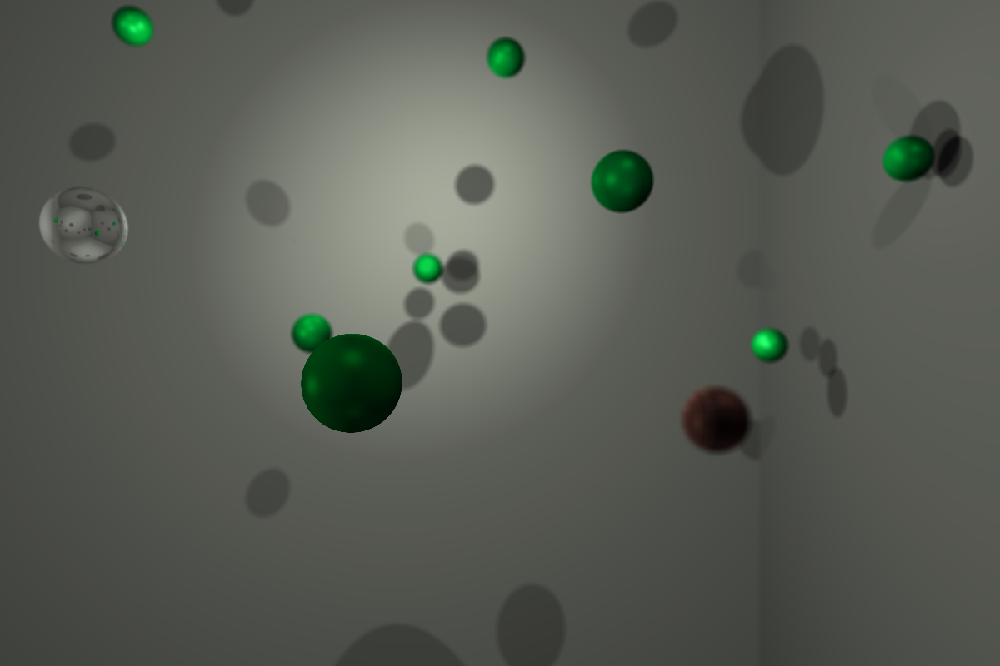

# RT

## Description

Le but de ce projet est de créer un raytracer de zéro.
Ce programme a été réalisé en C avec la librairie SDL2 et OpenCL.



## Installation

``` bash
$> git clone https://github.com/bmoiroud/RT.git && cd RT && make
```

## Utilisation

### Lancement classique
``` bash
$> ./rt <scene.xml>
```
### Utilisation du calcul en cluster:
lancer le programme en mode serveur sur un premier ordinateur:
``` bash
$> ./rt <scene.xml> --server <nombre de clients>
```

lancement en mode client:
``` bash
$> ./rt --client <ip serveur>
```

| Touche     | Action                 |
|:----------:|:-----------------------|
| W          | avancer                  |
| S          | reculer                  |
| A          | gauche                   |
| D          | droite                   |
| Q          | rotation à gauche        |
| E          | rotation à droite        |
| flèche haute | regarder en haut       |
| flèche basse | regarder en bas        |
| H          | afficher / cacher l'aide |
| I          | afficher / cacher infos  |
| P          | capture d'écran          |
| 1          | activer / désactiver effets |
| 2          | afficher / cacher plan de focus |
| Space      | monter                   |
| CTRL       | descendre                |
| Shift      | accélération             |
| esc        | quitter                  |

## Fonctionnalités
* Accélération OpenCL
* Clustering
* Profondeur de champ
* Anti-aliasing
* Textures procédurales
* Bump mapping
